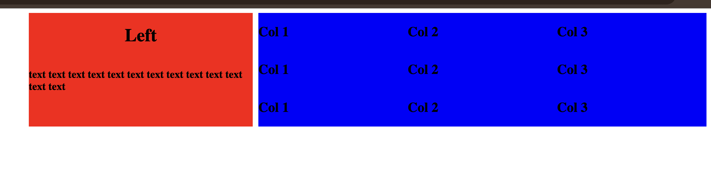

Create a grid layout now that looks like this

Here is a formatted grid layout using Markdown tables:

| Left (1x width)      | Right (2x width)                                   |
|----------------------|----------------------------------------------------|
| text text text text  | col 1 &#124; col 2 &#124; col 3                    |
| text text text text  | col 1 &#124; col 2 &#124; col 3                    |
| text text text text  | col 1 &#124; col 2 &#124; col 3                    |
| text text text text  |                                                    |

---

