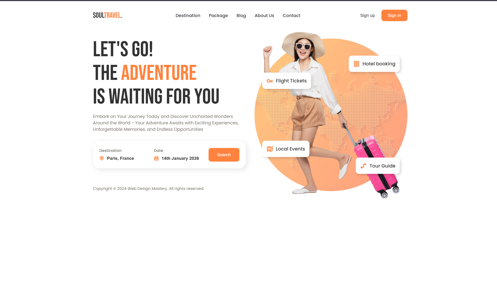

# Responsive Header with Navigation and Form

This project contains HTML & CSS code for a **responsive website header section** with:
- Fixed navigation bar (mobile-friendly hamburger menu).
- Hero section with image and floating info cards.
- Search form with adaptive layout.
- Fully responsive design for mobile, tablet, and desktop.

---

## ✨ Features

- **Responsive Navigation**
  - Mobile-friendly toggle menu.
  - Smooth transition animations.
  - Hover effects for desktop links.

- **Hero Section**
  - Large heading and description text.
  - Highlighted keywords with primary color.
  - Background image with circular overlay effect.
  - Floating statistic/info cards placed dynamically around the hero image.

- **Search Form**
  - Input fields with labels and icons.
  - Search button with hover effects.
  - Fully responsive — adapts from column layout (mobile) to row layout (desktop).

- **Theming with CSS Variables**
  - `--primary-color`, `--text-dark`, `--text-light`, etc.
  - Easy to update brand colors.

---

## 🛠 Technologies Used

- **HTML5** – Semantic structure.
- **CSS3** – Modern layout techniques (Flexbox, Grid, Clamp, CSS variables).
- **Google Fonts** – [Bebas Neue](https://fonts.google.com/specimen/Bebas+Neue) & [Poppins](https://fonts.google.com/specimen/Poppins).
- **Responsive Design** – Media queries for various breakpoints.

---

## 📂 Folder Structure

project/
│── index.html # Main HTML file
│── style.css # Main CSS file
│── assets/
│ └── header-bg.png # Background graphic for hero image

📸 Screenshot

🚀 Getting Started

Clone this repository

git clone https://github.com/mdas1998/Cohort.git

Open in your code editor

Open index.html in your browser to view the project.

📱 Responsive Breakpoints
Device Type	Breakpoint	Layout Changes
Mobile	< 768px	Vertical stacked navigation & form
Tablet	768px - 1024px	Partial desktop layout adjustments
Desktop	> 1024px	Horizontal form layout & full nav bar
⚡ Possible Improvements

Add JavaScript for:

Smooth scroll effects.

Form validation.

Replace static image with SVG illustrations.

Enhance accessibility with ARIA attributes.

📄 License

This project is open-source and available under the MIT License.